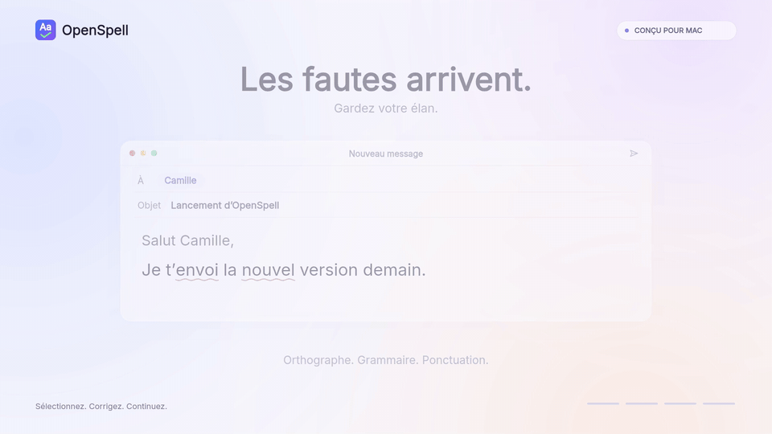
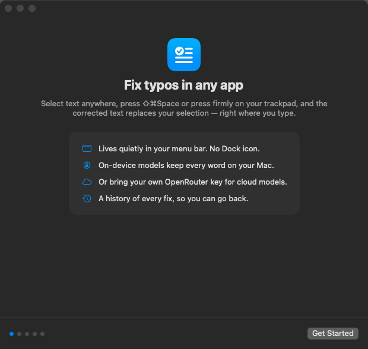
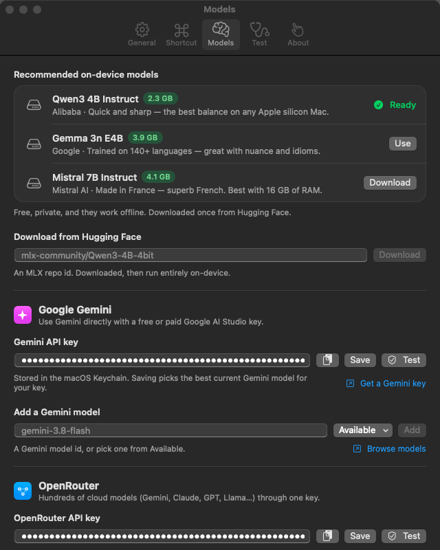

# OpenSpell

OpenSpell is a macOS menu bar app that fixes spelling, grammar and punctuation in any app. Select some text and press **⇧⌘Space**, or press firmly on the trackpad. The corrected text replaces your selection in place.

You can run corrections on your Mac with [MLX](https://github.com/ml-explore/mlx-swift) models, or in the cloud with your own Google Gemini or OpenRouter API key.

[](docs/screenshots/OpenSpell_QuickDemo_Static.mp4)



## Install

1. Download **OpenSpell-&lt;version&gt;.dmg** from the [latest release](https://github.com/lvanbei/openSpell/releases/latest).
2. Open it and drag **OpenSpell** to **Applications**.
3. Open OpenSpell from Applications. Releases are signed with a Developer ID and notarized by Apple, so macOS opens them without a warning.

OpenSpell needs macOS 15 or later on an Apple silicon Mac. To build it yourself, see [Build from source](#build-from-source).

## Features

- **Works in any app.** It fixes the selection in place and restores your clipboard afterwards.
- **Two triggers.** Use a global keyboard shortcut, or a force click with adjustable sensitivity. The force click fires before macOS's Look Up.
- **On-device models.** Download MLX models from Hugging Face. Your text stays on your Mac.
- **Cloud models.** Use the Google Gemini API or any text model on OpenRouter, including free ones.
- **Minimal edits.** It fixes mistakes without rephrasing or translating, and leaves formatting, URLs, mentions and code alone.
- **Language hint.** Auto-detect the language, or choose one of 17 languages.
- **History.** Your last 1,000 corrections are kept in a local log that you can search.
- **Guided setup and self-test.** A setup assistant helps with permissions and models. The Test tab runs health checks and an end-to-end correction in TextEdit.
- **Menu bar only.** There's no Dock icon, and the app can launch at login.

## Requirements

- macOS 15 or later
- An Apple silicon Mac (the build targets arm64, and on-device models need Apple silicon)
- Xcode with Swift 6.3 or later (mlx-swift requires it)

## Build from source

```sh
git clone https://github.com/lvanbei/openSpell.git
cd openSpell
./scripts/build.sh --install
```

[scripts/build.sh](scripts/build.sh) builds the Release configuration with `xcodebuild`, then assembles and signs `build/OpenSpell.app`. With `--install`, it also copies the app to `/Applications` and launches it. Compiler output goes to `build.log`. If Xcode's Metal toolchain is missing, the script installs it first.

| Option                                                            | Effect                                        |
| ----------------------------------------------------------------- | --------------------------------------------- |
| `--install`                                                       | Copy the app to `/Applications` and launch it |
| `CONFIG=Debug`                                                    | Build the Debug configuration                 |
| `CODESIGN_IDENTITY="Apple Development: you@example.com (TEAMID)"` | Sign with a specific identity                 |
| `VERSION=1.2.0 BUILD_NUMBER=42`                                   | Set the version and build number              |

By default, the script signs with the first Apple Development certificate in your keychain. If there isn't one, it signs ad-hoc. Use a stable identity if you can: with an ad-hoc signature, macOS forgets the Accessibility permission every time the binary changes.

To make a disk image, run `./scripts/package.sh` after building. It writes `build/OpenSpell-<version>.dmg` and a SHA-256 checksum next to it.

> [!NOTE]
> Build with the script or Xcode, not `swift build`. SwiftPM on the command line can't compile MLX's Metal shaders.

## Getting started

The first time you launch OpenSpell, the Setup Assistant walks you through four steps:

1. **Allow Accessibility.** Turn on OpenSpell in System Settings › Privacy & Security › Accessibility. OpenSpell needs this to read the selection, paste the fix and detect force clicks.
2. **Choose a language model.** Download the recommended on-device model, or paste a Gemini or OpenRouter API key.
3. **Learn your press.** Press firmly three times to calibrate force click sensitivity. If you don't have a Force Touch trackpad, skip this step.
4. **Try it.** Correct a sample sentence.

After setup, correcting text works like this:

1. Select text in any app.
2. Press **⇧⌘Space**, or press firmly on the trackpad.
3. A "Correcting…" bubble appears. When the model answers, the corrected text replaces your selection. If there's nothing to fix, the bubble says "No mistakes found".

Selections can be up to 12,000 characters long. If you switch to another app before the correction is ready, OpenSpell copies the fix to the clipboard instead of pasting it.

### Settings

To open Settings or History, click the menu bar icon.

| Tab      | What it does                                                                                                                               |
| -------- | ------------------------------------------------------------------------------------------------------------------------------------------ |
| General  | Set the language hint, launch at login, force click sensitivity, bubble position and history. Also shows whether Accessibility is allowed. |
| Shortcut | Record a different global shortcut                                                                                                         |
| Models   | Download on-device models, add API keys, and browse and choose cloud models                                                                |
| Test     | Run a health check, test the triggers, run an end-to-end correction in TextEdit, or try the playground                                     |

## Models



### On-device (MLX)

On-device models are free, keep your text private, and work offline once they're downloaded. They need an Apple silicon Mac. These are the recommended models:

| Model               | Hugging Face repo                             | Size   | Notes                                          |
| ------------------- | --------------------------------------------- | ------ | ---------------------------------------------- |
| Qwen3 4B Instruct   | `mlx-community/Qwen3-4B-Instruct-2507-4bit`   | 2.3 GB | The best balance of speed and quality          |
| Gemma 3n E4B        | `mlx-community/gemma-3n-E4B-it-lm-4bit`       | 3.9 GB | Trained on more than 140 languages             |
| Mistral 7B Instruct | `mlx-community/Mistral-7B-Instruct-v0.3-4bit` | 4.1 GB | Strong in French; works best with 16 GB of RAM |

You can also enter any Hugging Face repo that contains MLX weights (`*.safetensors`). Downloads use several parallel connections and resume where they left off. Each file is checked against its SHA-256 checksum.

### Google Gemini

Paste an API key from [Google AI Studio](https://aistudio.google.com), which offers a free tier. OpenSpell picks a fast, current Flash model for your key and keeps reasoning to a minimum. When Google retires a model, OpenSpell switches to its replacement automatically.

### OpenRouter

Paste an [OpenRouter](https://openrouter.ai) key. Then browse the catalogue, which shows prices, or enter a model slug. Models whose slugs end in `:free` cost nothing. If your key is on the free tier, OpenSpell switches to a free model automatically.

## Privacy

- On-device models never send your text anywhere.
- Cloud models send the selected text to Google or OpenRouter.
- API keys are stored in the macOS Keychain.
- History stays on your Mac. You can turn it off or clear it at any time.

| Data     | Location                                               |
| -------- | ------------------------------------------------------ |
| Settings | `UserDefaults` domain `app.openspell.OpenSpell`        |
| API keys | Keychain, service `app.openspell.OpenSpell`            |
| History  | `~/Library/Application Support/OpenSpell/history.json` |
| Models   | `~/Library/Application Support/OpenSpell/Models/`      |

## How it works

1. **Trigger.** The shortcut is registered as a Carbon global hotkey. For force clicks, a CGEvent tap reads the trackpad pressure. Once a correction starts, the tap swallows the rest of the press so the app underneath doesn't react.
2. **Read.** OpenSpell gets the selected text and its position on screen through the Accessibility API. If an app doesn't expose its text, OpenSpell sends ⌘C instead. Chromium and Electron apps are asked to turn on their accessibility tree.
3. **Correct.** The text goes to the selected model with a proofreading prompt ([CorrectionPrompt.swift](Sources/OpenSpell/Models/CorrectionPrompt.swift)). The temperature is 0, and reasoning is turned off or kept to a minimum. OpenSpell removes think blocks, code fences and wrapping quotes from the output, then restores the original leading and trailing whitespace.
4. **Write back.** If the original selection was lost, OpenSpell selects it again. It then pastes the fix with ⌘V and restores the clipboard. The temporary clipboard entry is marked so that clipboard managers ignore it.

## Troubleshooting

Start with **Settings › Test**. It checks the Accessibility permission, the shortcut, the force click listener and the model.

- **Accessibility is revoked after every rebuild.** The app is signed ad-hoc. Sign it with a stable identity (see [Build from source](#build-from-source)). To remove the stale permission entry, run `tccutil reset Accessibility app.openspell.OpenSpell`, then allow OpenSpell again.
- **The shortcut does nothing.** Another app might already use it. Record a different shortcut in Settings › Shortcut.
- **Force click doesn't trigger.** Turn on "Force Click and haptic feedback" in System Settings › Trackpad. The force click listener also needs the Accessibility permission.
- **The bubble says "fix copied, press ⌘V".** You switched apps, or the text changed, before the correction finished. The fix is on the clipboard.
- **OpenRouter returns error 402 or 429.** Error 402 means the model needs credits, and 429 means it's rate-limited. Pick a model marked Free, or try a different model.

## Releases

Releases are built on your Mac and published with the [GitHub CLI](https://cli.github.com). Sign in once with `gh auth login`, and enable the repository's git hooks once per clone:

```sh
git config core.hooksPath .githooks
```

From then on, every commit on `main` is published as the next patch release (1.0.1, 1.0.2, …). The [post-commit hook](.githooks/post-commit) runs [scripts/release.sh](scripts/release.sh), so the commit waits while the app builds, `main` is pushed and the release is uploaded. To commit without releasing, put `[skip release]` in the commit message. Commits made during a rebase, merge or cherry-pick aren't released.

To release a specific version, such as a minor update or a beta, commit and run the script yourself:

```sh
./scripts/release.sh 1.1.0
```

The script only releases from `main` with no uncommitted changes. It builds and packages `OpenSpell-1.1.0.dmg`, pushes `main`, then creates the `v1.1.0` tag and a release with the disk image, its checksum and install notes. A version with a suffix, such as `1.1.0-beta.1`, becomes a pre-release.

### Signing and notarization

Every release is signed with a Developer ID and notarized by Apple, so it opens without a Gatekeeper warning and keeps its Accessibility permission across updates. `release.sh` refuses to publish without both, and checks the result with Gatekeeper before it pushes anything. Set this up once per Mac (it needs a paid Apple Developer account):

1. **Developer ID certificate.** In Xcode, open Settings › Accounts, select your team and click **Manage Certificates**. Click **+** and choose **Developer ID Application**. Only the team's Account Holder can create it.
2. **Notarization credentials.** Create an app-specific password at [account.apple.com](https://account.apple.com) (Sign-In and Security › App-Specific Passwords), then save it in your keychain:

   ```sh
   xcrun notarytool store-credentials openspell --apple-id you@example.com --team-id TEAMID
   ```

`release.sh` finds the certificate on its own and uses the `openspell` profile. To use others, set `CODESIGN_IDENTITY` and `NOTARY_PROFILE`.

## Developer CLI

The app binary has a few hidden flags for smoke tests:

```sh
APP=build/OpenSpell.app/Contents/MacOS/OpenSpell

# Download an MLX model
$APP --download mlx-community/Qwen3-4B-Instruct-2507-4bit

# Correct a string with a downloaded model, an OpenRouter slug or a Gemini model
$APP --correct mlx-community/Qwen3-4B-Instruct-2507-4bit "I beleive its definately ready."
$APP --correct openrouter:google/gemini-2.5-flash "I beleive its definately ready."
GEMINI_API_KEY=your-key $APP --correct gemini:gemini-flash-latest "I beleive its definately ready."

# Run the health checks and the TextEdit end-to-end test (the local model is optional)
$APP --e2e mlx-community/Qwen3-4B-Instruct-2507-4bit

# Save every window as a PNG file
$APP --snapshot /tmp/openspell-snapshots
```

`openrouter:` uses the API key saved in the Keychain. `gemini:` uses `GEMINI_API_KEY` if it's set, and the saved key if it isn't.

## Project structure

| Path                                                 | Contents                                                                                                         |
| ---------------------------------------------------- | ---------------------------------------------------------------------------------------------------------------- |
| [Sources/OpenSpell/App](Sources/OpenSpell/App)       | Entry point, menu bar item and developer CLI                                                                     |
| [Sources/OpenSpell/Core](Sources/OpenSpell/Core)     | Correction pipeline, text access, shortcut and force click triggers, settings, history, Keychain and diagnostics |
| [Sources/OpenSpell/Models](Sources/OpenSpell/Models) | Prompt, MLX runtime, Hugging Face downloader, Gemini and OpenRouter clients, and the model store                 |
| [Sources/OpenSpell/UI](Sources/OpenSpell/UI)         | SwiftUI views for settings, history and the setup assistant                                                      |
| [Resources/Info.plist](Resources/Info.plist)         | App bundle metadata                                                                                              |
| [scripts/build.sh](scripts/build.sh)                 | Script that builds, signs and installs the app                                                                   |
| [scripts/package.sh](scripts/package.sh)             | Script that packages the app into a disk image and can sign and notarize it                                      |
| [scripts/release.sh](scripts/release.sh)             | Script that builds the app on your Mac and publishes it as a GitHub release                                      |
| [.githooks/post-commit](.githooks/post-commit)       | Git hook that publishes every commit on `main` as the next patch release                                         |
| [scripts/make-icon.swift](scripts/make-icon.swift)   | Script that renders the app icon                                                                                 |
